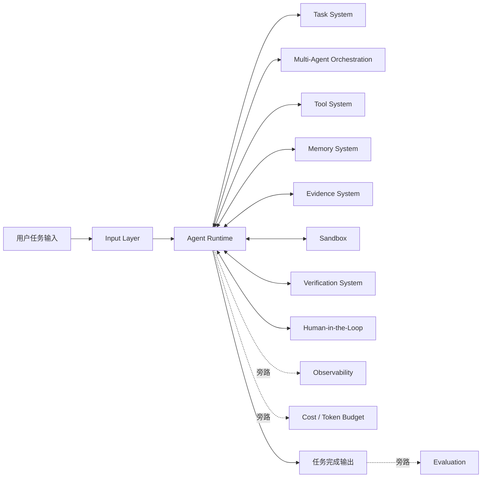

# Odin — AI 代码研究系统

基于证据链驱动的代码分析框架，服务于系统化漏洞研究。

---

## 最新更新（v0.2.0）

Odin 已从"LLM 提示词框架"升级为**完全自主的 AI Agent 系统**：

- **Tool Executor**：LLM 现在可以调用真实工具来读取文件、搜索代码、执行 Shell 命令和 Git 操作
- **Agent Loop**：迭代式 LLM → 工具 → LLM → 工具 → ... → 输出 循环
- **CLI**：`odin analyze <repo>` 端到端分析命令
- **Pipeline Parallelism**：DAG 分层并行执行独立工作流步骤
- **MCP Integration**：通过 Model Context Protocol 连接 GitHub、CVE、Jira
- **FastAPI Server**：支持团队协作的 HTTP API
- **RAG Store**：对历史分析报告进行全文检索
- **Evaluation Framework**：Precision / Recall / F1 基准评测

---

## Architecture

```
CLI / API Server
    └─→ PipelineExecutor          (DAG 分层并行执行)
              └─→ SkillAgent（每步骤）   (LLM 循环 + 工具调用)
                        ├─→ LLM Adapter      (OpenAI / Anthropic / Ollama / Mock)
                        └─→ ToolExecutor     (read_file / search_code / git_ops / ...)
                                 └─→ EvidenceStore / MemoryStore / RAGStore
```

---

## Quick Start

```bash
# 安装依赖
pip install -e "."

# 或者一次性安装所有依赖
pip install openai anthropic fastapi uvicorn pydantic pyyaml jsonschema

# 列出可用 Skills
python odin.py list-skills
python odin.py list-workflows

# 分析本地仓库（mock 模式，无需 API key）
python odin.py analyze ./my-repo --workflow codebase_research --provider mock --verbose

# 分析 GitHub 仓库（需要 OPENAI_API_KEY）
export OPENAI_API_KEY=sk-...
python odin.py analyze https://github.com/owner/repo \
  --workflow vulnerability_research --provider openai --model gpt-4o-mini

# 输出到文件
python odin.py analyze ./my-repo --output ./report.md --output-format markdown

# 启动 API Server
python -m uvicorn cli.commands.serve:app --reload --port 8080
# 然后：POST /analyze with {"repo_url": "https://github.com/..."}
```

---

## Project Structure

```
Odin/
├── tools/                        # Phase 1: Tool Execution Layer
│   ├── base.py                  # Tool 接口、ToolResult、ToolContext
│   ├── executor.py              # ToolExecutor — 注册表、调度、历史记录
│   ├── registry.py              # @tool 装饰器
│   └── builtin/
│       ├── read_file.py         # 按行范围读取文件
│       ├── list_dir.py          # 目录树列表
│       ├── search_code.py       # 正则代码搜索（带上下文行）
│       ├── run_shell.py         # 安全 Shell 命令（白名单）
│       ├── git_ops.py           # git clone / log / diff
│       └── detect_lang.py        # 技术栈检测
│
├── agent/                       # Phase 2: Agent Loop Layer
│   ├── messages.py              # HumanMessage / AIMessage / ToolMessage / SystemMessage
│   ├── state.py                 # AgentState + LoopConfig（迭代限制、证据规则）
│   ├── llm_adapter.py          # LLM Adapter — OpenAI / Anthropic / Ollama / Mock
│   ├── loop.py                  # AgentLoop — 核心迭代引擎
│   ├── skill_agent.py           # SkillAgent — 将 Skill 包装为 Agent
│   └── merger.py                # AgentResultMerger — 多 Agent 结果聚合
│
├── core/
│   ├── skill_loader.py         # Skill 加载与注册
│   ├── workflow_orchestrator.py # Workflow DAG 加载与执行
│   ├── pipeline_executor.py     # Phase 4: DAG 分层并行执行
│   ├── prompt_runner.py         # Prompt 渲染、LLM 调用、JSON 验证
│   ├── schema_validator.py      # JSON Schema Draft-2020-12
│   ├── execution_context.py     # 变量解析 ${inputs.x} / ${steps.S.outputs.y}
│   └── errors.py               # 分层异常类型
│
├── cli/
│   ├── main.py                 # CLI 入口
│   └── commands/
│       ├── analyze.py           # analyze <repo> 命令
│       ├── serve.py             # FastAPI HTTP 服务器
│       ├── list_skills.py
│       └── list_workflows.py
│
├── mcp/                        # Phase 5: MCP Client
│   └── client.py               # MCP stdio 客户端 + GitHub / CVE / Jira 适配器
│
├── rag/                        # Phase 6: RAG Store
│   └── store.py                # SQLite FTS5 全文搜索历史报告
│
├── memory/
│   ├── models.py               # MEU、ResearchArtifact、Conclusion、EvidenceLink
│   ├── evidence_store.py        # MEU 存储、索引、检索
│   └── memory_store.py          # Artifact 与 Conclusion 存储
│
├── skills/                      # 12 个 MVP Skills
│   ├── repo_map/               # 构建模块地图
│   ├── entrypoints_detection/   # 查找 HTTP/CLI/message handlers
│   ├── call_graph_trace/        # 追踪调用关系
│   ├── data_structure_extraction/
│   ├── auth_logic_detection/
│   ├── input_flow_analysis/
│   ├── sink_detection/          # 识别危险 sink
│   ├── dependency_analysis/
│   ├── attack_surface_mapping/
│   ├── vulnerability_hypothesis/
│   ├── exploit_generation/
│   └── report_generation/
│
├── workflows/                   # 3 个 Workflow 定义（YAML）
│   ├── vulnerability_research/  # 11 步骤：完整漏洞研究
│   ├── codebase_research/        # 5 步骤：快速代码库理解
│   └── architecture_analysis/   # 7 步骤：深度架构分析
│
├── benchmarks/                  # Phase 6: Evaluation Framework
│   └── eval.py                 # Precision / Recall / F1 基准评测
│
├── examples/
│   └── run_workflow.py
│
├── odin.py                     # CLI 入口
├── pyproject.toml
└── README.md
```

---

## Skills（12 个 MVP）

| Skill | 用途 | 阶段 |
|-------|------|------|
| `repo_map` | 构建模块地图，检测技术栈 | MVP |
| `entrypoints_detection` | 查找 HTTP/CLI handlers | MVP |
| `call_graph_trace` | 追踪函数调用关系 | MVP |
| `data_structure_extraction` | 提取实体模型 | MVP |
| `auth_logic_detection` | 定位认证/鉴权守卫 | MVP |
| `input_flow_analysis` | 追踪输入到 sink 的数据流 | MVP |
| `sink_detection` | 识别危险 sink 函数 | MVP |
| `dependency_analysis` | 映射第三方依赖 | MVP |
| `attack_surface_mapping` | 关联攻击面与风险 | MVP |
| `vulnerability_hypothesis` | 生成带 CWE 标签的漏洞假设 | MVP |
| `exploit_generation` | 生成 PoC 概念 | MVP |
| `report_generation` | 生成结构化 Markdown 报告 | MVP |

---

## Workflows

### `vulnerability_research`（11 步骤）
完整链路：`repo_discovery → entrypoints → call_graph → auth → input_flow → sinks → deps → attack_surface → hypotheses → PoC → report`

### `codebase_research`（5 步骤）
快速理解：`repo_discovery → entrypoints → call_graph → data_structures → report`

### `architecture_analysis`（7 步骤）
深度架构：`repo_discovery → entrypoints → call_graph → data_structures → auth → deps → report`

---

## Evidence Model

Odin 中的每个结论都必须以一个 **MEU（Minimum Evidence Unit，最小证据单元）** 作为支撑：

```json
{
  "meu_id": "MEU-abc123def4",
  "file_path": "src/auth/login.py",
  "symbol": "validate_token",
  "line_start": 42,
  "line_end": 58,
  "snippet": "def validate_token(token: str) -> bool: ...",
  "extracted_by": "call_graph_trace@1.0.0",
  "confidence": 0.95
}
```

**没有证据就没有结论。** 框架在运行时强制执行此规则。

---

## Configuration

### 环境变量

```bash
# OpenAI（推荐：gpt-4o-mini 性价比最优）
export OPENAI_API_KEY=sk-...

# Anthropic Claude
export ANTHROPIC_API_KEY=sk-ant-...

# 可选覆盖
export ODIN_PROVIDER=openai
export ODIN_MODEL=gpt-4o-mini
```

### LLM Provider Selection

```python
from agent.llm_adapter import create_adapter

# OpenAI
llm = create_adapter("openai", default_model="gpt-4o-mini")

# Anthropic
llm = create_adapter("anthropic", default_model="claude-sonnet-4-20250514")

# 本地 Ollama
llm = create_adapter("ollama", base_url="http://localhost:11434/v1", default_model="llama3")

# Mock（用于测试）
llm = create_adapter("mock")
```

### Workflow Selection

| CLI Flag | 描述 |
|----------|------|
| `--workflow vulnerability_research` | 完整安全分析（11 步骤）|
| `--workflow codebase_research` | 快速理解（5 步骤）|
| `--workflow architecture_analysis` | 深度架构分析（7 步骤）|

---

## Phase 1 — Tool Executor

Tool 层赋予 LLM 真正的"双手"来与代码库交互：

| Tool | 描述 |
|------|------|
| `read_file` | 按行范围读取文件内容 |
| `list_dir` | 带文件类型图标的目录树列表 |
| `search_code` | 正则搜索（带上下文行）|
| `run_shell` | 安全 Shell 命令（白名单：git、find、grep、wc 等）|
| `git_clone` | 将远程仓库克隆到本地临时目录 |
| `git_log` | 查看提交历史 |
| `git_diff` | 查看提交间的文件变更 |
| `detect_lang` | 检测编程语言和框架 |

所有 Tool 均使用 **Function Calling API** 格式，确保 LLM 集成的可靠性。

---

## Phase 2 — Agent Loop

Agent Loop 实现迭代式 LLM ↔ 工具交互：

```
Render Skill Prompt → LLM → Has tool_calls?
    ├─ Yes → Execute tools → Append ToolMessage → LLM (continue)
    └─ No → Extract JSON output → Validate → Store MEUs → Done
```

- 最大迭代次数：20（可配置）
- 证据强制：每个发现必须引用 `evidence_refs`
- Schema 验证：JSON Schema Draft-2020-12

---

## Phase 4 — Parallel Pipeline

Workflow 步骤按 **DAG 分层** 组合并并行执行：

```
Layer 1: repo_discovery
Layer 2: entrypoints_detection, sink_detection, dependency_analysis  ← 并行
Layer 3: call_graph_trace, auth_logic_detection                 ← 并行
Layer 4: input_flow_analysis
Layer 5: attack_surface_mapping
Layer 6: vulnerability_hypothesis
Layer 7: exploit_generation
Layer 8: report_generation
```

同一层的独立步骤通过 `ThreadPoolExecutor` 并发运行。

---

## Phase 6 — RAG Store

历史报告通过 **SQLite FTS5** 分块索引（无需外部依赖）：

```python
from rag.store import RAGStore

rag = RAGStore(persist_dir="./data/rag")
rag.index_report(run_id="run_xxx", report_text="...", repo_url="...")
context = rag.get_context_for_prompt("authentication vulnerability in JWT")
# → 注入下次分析 Prompt，减少重复工作
```

---

## Evaluation Framework

```bash
# 列出可用基准数据集
python benchmarks/eval.py

# 运行所有基准测试（mock 模式）
python benchmarks/eval.py --all --provider mock

# 运行特定数据集
python benchmarks/eval.py --dataset owasp-sql-injection --provider openai

# 输出结果
python benchmarks/eval.py --all --output-dir ./benchmarks/results
```

评测指标：**Precision / Recall / F1**，以真实漏洞数据集为基准。

---

## Development Roadmap

详见 `odin_ai_code_research_system_-_完整开发规划_b2a6d593.plan.md`。

---

## 架构演进路线

### 2.1 架构总览

Odin 的目标架构分为 6 层、18 个维度，按优先级分批实现：

- **P0（执行核心）**：Agent Runtime、Task System、Multi-Agent Orchestration、Tool System、Memory System、Evidence System
- **P1（安全与可观测）**：Sandbox、Verification System、Human-in-the-Loop、Observability、Evaluation、Cost / Token Budget
- **P2（治理层）**：Permission System、State Recovery、Output Validation

**输入层**（决定 Agent 理解准确度和长任务稳定性）不属于本项目当前范围，架构图中作为外部前置依赖标注。

### 2.2 六层十八维度详细说明

#### 输入层

| 维度 | 项目现状 | 说明 |
|------|---------|------|
| Input Processing | 待引入 | 用户输入的解析与意图识别，决定 Agent 理解任务的准确度 |
| Context Management | 待引入 | 管理塞入 LLM 的内容，做压缩/摘要/裁剪，防止长任务 context 溢出导致幻觉 |
| Planner | 待引入 | 把用户任务拆解成有序子任务，Runtime 负责执行但"怎么拆"是独立问题 |

#### 执行核心（P0）

| 维度 | 项目现状 | 说明 |
|------|---------|------|
| Agent Runtime | 待完善（现有 AgentLoop 为雏形） | Agent Loop 的控制引擎（Think → Plan → Act → Observe），支持多步骤自主执行、Checkpoint、重试 |
| Task System | 待引入 | 任务的创建、排队、恢复和失败处理，支持长时间运行任务 |
| Multi-Agent Orchestration | 待引入 | 主控 Agent 拆分子任务交给多个子 Agent 并行执行，复杂任务单 Agent 串行太慢 |

#### 工具与记忆（P0）

| 维度 | 项目现状 | 说明 |
|------|---------|------|
| Tool System | 待完善（现有 ToolExecutor 为雏形） | 工具注册与调用机制，AI 能自主选择并执行文件、代码、网络等操作 |
| Memory System | 待完善（现有 MemoryStore / EvidenceStore 为雏形） | 短期上下文 + 长期知识存储（向量库），跨步骤保持任务状态 |
| Evidence System | 已有基础（现有 Evidence Model / MEU 为雏形） | AI 的每个结论必须绑定来源（代码片段/文件位置/调用关系），防止幻觉 |

#### 安全与验证（P1）

| 维度 | 项目现状 | 说明 |
|------|---------|------|
| Sandbox | 待引入 | 危险操作的隔离执行环境（Docker），防止 Agent 行为影响宿主系统 |
| Verification System | 待引入 | 对 AI 输出做规则验证/单元测试/代码执行验证，确保结论可信 |
| Human-in-the-Loop | 待引入 | Agent 遇到高风险操作时暂停等待人工确认，比 Sandbox 更早介入 |

#### 可观测性（P1）

| 维度 | 项目现状 | 说明 |
|------|---------|------|
| Observability | 待引入 | Agent 每一步的 Logs / Traces / Metrics，让执行过程完整可追踪 |
| Evaluation | 待完善（现有 benchmarks/eval.py 为雏形） | 任务成功率、幻觉率、工具调用成功率等指标的度量机制 |
| Cost / Token Budget | 待引入 | 每个任务的 token 消耗上限控制，防止失控任务耗尽额度 |

#### 治理层（P2）

| 维度 | 项目现状 | 说明 |
|------|---------|------|
| Permission System | 待引入 | 比 Sandbox 更细粒度，控制 Agent 能读哪些文件、调哪些 API |
| State Recovery | 待引入 | 任务断点快照与续跑，系统崩溃后可从上次 Checkpoint 恢复 |
| Output Validation | 待引入 | 对最终输出做格式校验和后处理，确保交付物符合预期 |

### 2.3 架构流向图



### 2.4 参考资料

#### 论文（arxiv.org）

- **ReAct** — Agent Loop Think + Act + Observe 的原始论文，提出将推理与行动协同的范式
- **Toolformer** — Tool System 设计基础，探索 LLM 如何自主学习调用外部工具
- **MemGPT** — Memory System 分层架构，突破固定上下文限制的分层记忆管理
- **SWE-bench** — Agent Evaluation 标准评测集，基于真实 GitHub Issue 的代码修复评测基准

#### 开源项目（github.com）

- **OpenHands（原 OpenDevin）** — `opendevin/opendevin`，完整 Agent Framework 实现，含沙箱隔离、EventStream、长期记忆
- **LangGraph** — `langchain-ai/langgraph`，Task System + Agent Loop 的工程参考，基于 LangChain 的状态图编排
- **AutoGen（微软）** — `microsoft/autogen`，v0.4 基于 Actor 模型异步事件驱动，Multi-Agent Orchestration 标杆实现
- **Langfuse** — `langfuse/langfuse`，Observability 完整实现，含 Trace / LLM Batch / Quality 监控

#### 系统性文章

- **Lilian Weng 博客**（lilianweng.github.io）— *LLM-powered Autonomous Agents*，所有维度的入门地图，覆盖 Planning / Memory / Tool / 论文链接
- **Eugene Yan 博客**（eugeneyan.com）— Agent 系统工程实践，长任务稳定性、工具调用优化、Evaluation 方法论

---

## License

MIT
